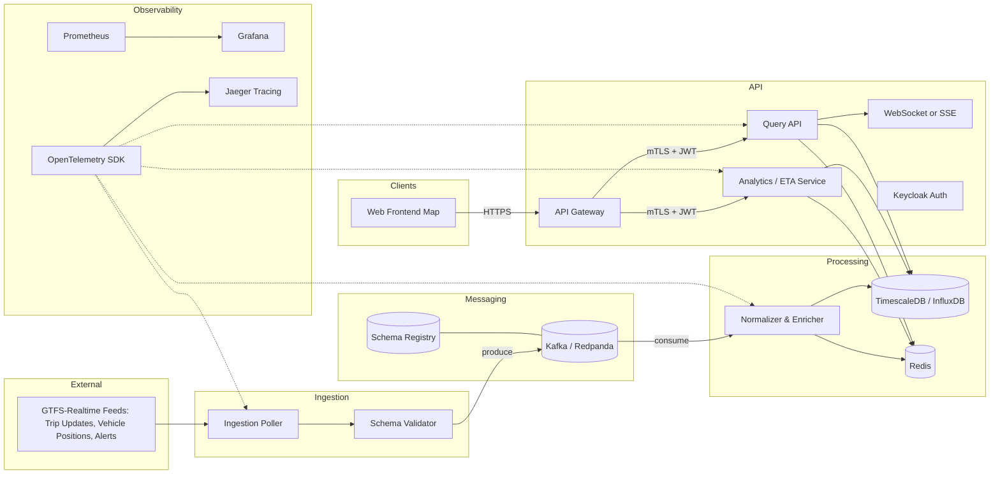

# DublinBusNet-A-Distributed-Real-Time-Public-Transport-Tracker
A distribute real time bus tracker for Dublin Bus.

```mermaid
flowchart LR
subgraph External
    GTFSRT[GTFS-Realtime Feeds: Trip Updates, Vehicle Positions, Alerts]
  end

  subgraph Ingestion
    Poller[Ingestion Poller]
    Validator[Schema Validator]
  end

  subgraph Messaging
    Kafka[(Kafka / Redpanda)]
    SR[(Schema Registry)]
  end

  subgraph Processing
    Normaliser[Normalizer & Enricher]
    TSDB[(TimescaleDB / InfluxDB)]
    Cache[(Redis)]
  end

  subgraph API
    Gateway[API Gateway]
    Query[Query API]
    WS[WebSocket or SSE]
    Analytics[Analytics / ETA Service]
    Auth[Keycloak Auth]
  end

  subgraph Observability
    OTel[OpenTelemetry SDK]
    Prom[Prometheus]
    Grafana[Grafana]
    Jaeger[Jaeger Tracing]
  end

  subgraph Clients
    Web[Web Frontend Map]
  end

  GTFSRT --> Poller --> Validator -->|produce| Kafka
  SR --- Kafka
  Kafka -->|consume| Normaliser --> TSDB
  Normaliser --> Cache
  Analytics --> TSDB
  Analytics --> Cache
  Gateway -->|mTLS + JWT| Query
  Gateway -->|mTLS + JWT| Analytics
  Query --> TSDB
  Query --> Cache
  Query --> WS
  Web -->|HTTPS| Gateway
  OTel -.-> Poller
  OTel -.-> Normaliser
  OTel -.-> Query
  OTel -.-> Analytics
  Prom --> Grafana
  OTel --> Jaeger
```
