# DublinBusNet — Real-Time Distributed Transit Tracker

## Project Overview
**DublinBusNet** is a distributed system designed to provide **real-time tracking, analysis, and prediction of Dublin Bus locations** using the public **GTFS-Realtime API**.  
The project demonstrates key distributed systems principles, including **scalability**, **fault tolerance**, **asynchronous communication**, and **architectural trade-off analysis**.

This project is developed as part of the **COMP41720 Distributed Systems capstone**.

---

## Core Objectives

1. **Collect** live bus data (positions, trips, alerts) from the Dublin Bus GTFS-Realtime feeds.  
2. **Process and normalise** data across distributed microservices.  
3. **Store** time-series data in a scalable, queryable database.  
4. **Expose** a secure API and real-time frontend for live bus tracking and ETAs.  
5. **Demonstrate** distributed system design trade-offs in our report and ADRs.

---

## ⚙️ System Architecture

We use a **microservices-based distributed architecture** combining both **asynchronous** (Kafka) and **synchronous** (REST/gRPC) communication.

### **Service Overview**

| Service | Description | Communication |
|----------|--------------|----------------|
| **Ingestion Service** | Polls GTFS-Realtime feeds (TripUpdates, VehiclePositions, Alerts). | Publishes messages to Kafka / Redpanda |
| **Processing Service** | Normalises and enriches bus data for storage. | Consumes from Kafka, writes to DB |
| **Analytics Service** | Performs ETA calculations and route statistics. | REST / gRPC |
| **API Gateway & Query Service** | Provides REST and WebSocket APIs for frontend clients. | HTTPS / WebSocket |
| **Frontend (Web)** | Displays real-time bus locations and analytics. | WebSocket / HTTPS |

### **Supporting Components**

- **Kafka / Redpanda** — Asynchronous messaging backbone.  
- **TimescaleDB / InfluxDB** — Time-series data store.  
- **Redis** — High-speed caching layer.  
- **Docker + Kubernetes** — Containerisation and orchestration.  
- **Prometheus + Grafana** — Monitoring and observability.  
- **Keycloak + mTLS** — Authentication and service-level security.

---
## Simplified High-Level Architecture Diagram

```mermaid
flowchart LR
    subgraph External["External Data Sources"]
        A[GTFS-Realtime API<br>TripUpdates, VehiclePositions]
    end

    subgraph Cluster1["DublinBusNet Microservices"]
        subgraph S1["🛰 Data Ingestion Service"]
            B1[Poll GTFS Data]
            B2[Parse & Validate]
            B3[Publish to Kafka Topic]
        end

        subgraph S2[" Analytics & Prediction Service"]
            C1[Consume Kafka Stream]
            C2[Store Processed Data → DB]
            C3[Generate Delay Predictions]
        end

        subgraph S3[" API Gateway / Frontend"]
            D1[Expose REST / WebSocket APIs]
            D2[Serve Web Dashboard]
        end
    end

    subgraph Storage["🗄 Database Service (PostgreSQL + PostGIS)"]
        E1[(Historical + Geospatial Data)]
    end

    %% Data Flow
    A -->|protobuf / HTTP| B1
    B3 -->|async stream| C1
    C2 -->|write| E1
    C3 -->|processed data| D1
    D1 -->|fetch| E1

    %% Clients
    subgraph Clients["User Interface"]
        F1[User Browser / Dashboard]
    end
    F1 -->|HTTP / WebSocket| D2

    %% Styling
    classDef service fill:#e6f7ff,stroke:#0366d6,stroke-width:1px;
    class S1,S2,S3 service;
    classDef external fill:#fdf2f8,stroke:#d63384,stroke-width:1px;
    class External external;
    classDef storage fill:#f0fdf4,stroke:#16a34a,stroke-width:1px;
    class Storage storage;
    classDef clients fill:#fff7ed,stroke:#fb923c,stroke-width:1px;
    class Clients clients;

```

## Expanded High-Level Architecture Diagram

